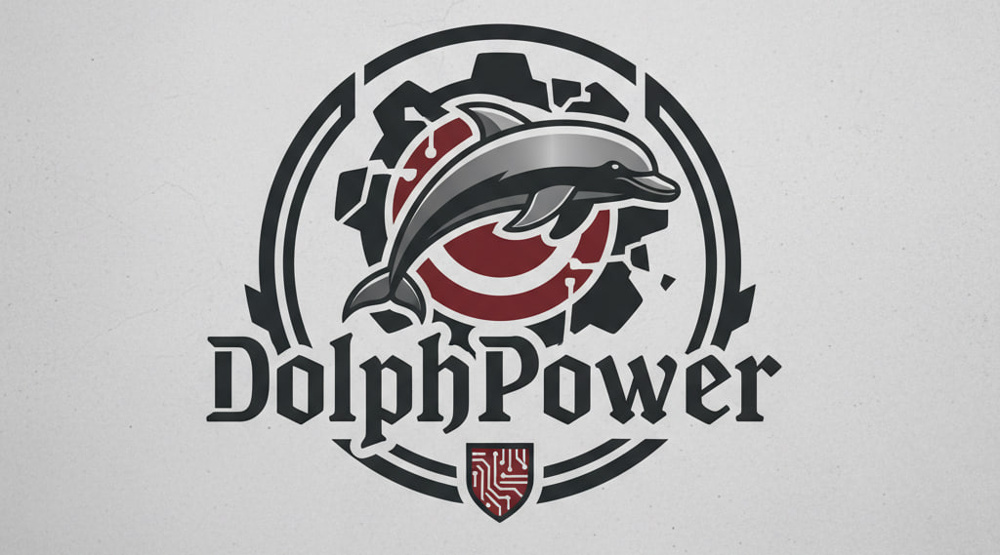

# DolfPower - Антидетект Браузер с ИИ-Агентом

<p align="center">
  
</p>

DolfPower — это современный антидетект-браузер с открытым исходным кодом, ориентированный на приватность, безопасность и продвинутую автоматизацию с помощью ИИ. В отличие от традиционных решений, DolfPower включает в себя ИИ-агента (Jarvis), который берет на себя управление фермой аккаунтов и выполнение сложных сценариев.

## 🚀 Легкость автоматизации с ИИ

DolfPower создан для эпохи ИИ. В него интегрирован **Jarvis**, ваш персональный агент:
- **Автоматизация на естественном языке**: Просто опишите задачу словами, и Jarvis сам сгенерирует и запустит RPA-сценарий.
- **Самозалечивающиеся селекторы**: Если верстка сайта изменилась, Jarvis проанализирует HTML-код и автоматически исправит сценарий, чтобы работа не прерывалась.
- **Гуманизированное поведение**: Движения мыши по кривым Безье, естественные задержки и симуляция "опечаток" при наборе текста делают автоматизацию неотличимой от действий реального человека.
- **Встроенный Overlay**: Общайтесь с Jarvis прямо внутри открытого окна браузера через удобный интерфейс.
- **Поддержка MCP**: Расширяйте возможности Jarvis, подключая внешние инструменты и сервисы через Model Context Protocol.

## 🔒 Бескомпромиссная безопасность

Безопасность — наш главный приоритет. В DolfPower реализована многоуровневая защита:
- **Мастер-пароль**: Все конфиденциальные данные (API-ключи, пароли прокси, секреты TOTP, куки) шифруются алгоритмом AES-256. Ключ шифрования хранится только в оперативной памяти и исчезает при выходе.
- **Двухфакторная аутентификация (2FA)**: Поддержка TOTP для защиты вашего аккаунта и подтверждения критических действий.
- **Привязка к "железу"**: На этапе инициализации данные защищены уникальным ключом, привязанным к идентификаторам вашего ПК.
- **Telegram Sandbox**: Управляйте своей фермой через Telegram в безопасном режиме с обязательным подтверждением действий через PIN-код.
- **Финальный аудит сессии**: При выходе система автоматически очищает ключи шифрования и закрывает все активные сессии.

## ✨ Основные возможности

- **40+ параметров отпечатка**: Полный контроль над Canvas, WebGL, Audio, WebRTC, Media Devices, шрифтами и многим другим.
- **Изолированные окружения**: Каждый профиль имеет собственные куки, хранилище и отпечаток, что исключает связь между аккаунтами.
- **Умное управление прокси**: Поддержка HTTP/SOCKS5 с автоматической синхронизацией языка, таймзоны и геолокации по IP.
- **Поиск бесплатных прокси**: Встроенный модуль для сбора и тестирования бесплатных прокси из публичных источников.
- **Управление расширениями и закладками**: Глобальные и индивидуальные настройки для каждого профиля.
- **Полноценный REST API**: Управляйте браузером программно или интегрируйте его со своими ИИ-агентами.

## 🛠 Быстрый старт

### Установка
```bash
git clone https://github.com/MixasV/DolfPower.git
cd DolfPower
npm install
npm run build
npm run dev:server
```

### Доступ к Jarvis
Запустите сервер и перейдите по адресу `http://127.0.0.1:3001/ui/`. Установите Мастер-пароль и начните работу с ИИ-помощником.

## 📚 Документация
Подробные руководства, справочник API и советы по автоматизации доступны в разделе [Documentation](docs/introduction_RU.md).

## 📄 Лицензия
MIT License. Свободно для использования, изменения и распространения.

---
Автор: [Mixas](https://mixas.pro/)
- Telegram: [@onexv](http://onexv.t.me/)
- Twitter: [@MihailVarich](https://x.com/MihailVarich)
